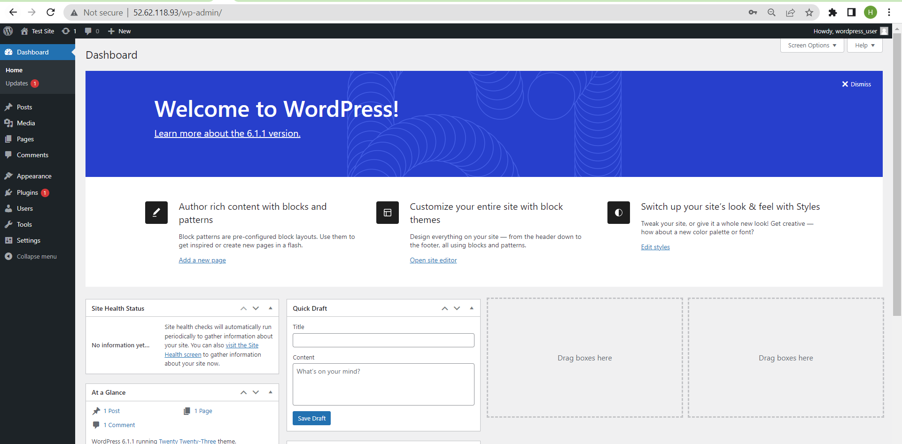

# terraform-rds-ec2-wordpress
Terraform + EC2 + WordPress + RDS

## This project is realized with terraform, and allows :
### 1. Create an RDS database with MySQL 5.7
### 2. Create an EC2 Instance to install WordPress and preconfigure it
### 3. Return the information for the connection to the RDS database and the connection to the EC2 server

__Note :__  Change database entries ,regions and other variable in main.tf file. This file is commented in order to make it understandable. In this file, we also have the Output instructions that allow to display the information when the infrastructure is set up.

```sh
module aws_wordpress {
    source              = "./modules/latest"
    database_name           = "wordpress_db"   // database name
    database_user           = "wordpress_user" //database username
    // Password here will be used to create master db user.It should be chnaged later
    database_password = "PassWord4-user" //password for user database
    shared_credentials_file = "~/.aws/credentials"         //Access key and Secret key file location
    region                  = "ap-southeast-2" //sydney region
    IsUbuntu                = true             // true for ubuntu,false for linux 2  //boolean type
    // avaibility zone and their CIDR
    AZ1          = "ap-southeast-2a" // for EC2
    AZ2          = "ap-southeast-2b" //for RDS 
    AZ3          = "ap-southeast-2c" //for RDS
    VPC_cidr     = "10.0.0.0/16"     // VPC CIDR
    subnet1_cidr = "10.0.1.0/24"     // Public Subnet for EC2
    subnet2_cidr = "10.0.2.0/24"     //Private Subnet for RDS
    subnet3_cidr = "10.0.3.0/24"     //Private subnet for RDS
    PUBLIC_KEY_PATH  = "./mykey-pair.pub" // key name for ec2, make sure it is created before terrafomr apply
    PRIV_KEY_PATH    = "./mykey-pair"
    instance_type    = "t2.micro"    //type of instance
    instance_class   = "db.t2.micro" //type of RDS Instance
    root_volume_size = 22
}

# Outputs informations
output "RDS_END_POINT" {
  value = module.aws_wordpress.RDS-Endpoint
}

output "RDS_DB_NAME" {
  value = module.aws_wordpress.db_name
}
output "RDS_DB_PASSWORD" {
  value = module.aws_wordpress.db_password
}
output "RDS_DB_USERNAME" {
  value = module.aws_wordpress.db_user
}
output "WordPress_login" {
  value = module.aws_wordpress.wordpress_url
}
```

## We also have two scripts, which allow to install wordPress when the instance starts
  This script is default for Ubuntu   
  If you want to configure wordpress in AWS LINUX 2 then change __IsUbuntu__ value to __false__ in __variables.tfvars__

  Make sure you have configured aws CLI in your local machine

  __user_data.sh__ is script for LINUX 2 and __userdata_ubuntu.sh__ is for Ubuntu

  __Note :__ You can consult the content of these scripts in this repository

### ami-id will be imported using data.aws_ami 
 <h3> Security: </h3>
<p> EC2 will be launched in public subnet and RDS will be launched in private subnet </p>
<p> Only EC2 with defined security group can access RDS and RDS wont have internet access </p>
<p> Password for RDS will be used to create the resource, later it should be changed manually for security purposes. Terraform will ignore any changes in password 

<h2> Prerequisite </h2>
<p> Before launching Terraform template, aws cli should be installed and configured with proper access key and secret key </p>
<p> Terraform should be installed in your local machine </p>
<p> Configure AWS CLI with <code> aws configure </code> if you havent configured already </p>


<h2> STEPS: </h2>

 <p>Clone this repo using command then go to the folder that is created </p>

 ```sh
 git clone https://github.com/utrains/terraform-rds-ec2-wordpress.git
 cd terraform-rds-ec2-wordpress
 ```

### Initialize the ssh key that this repository will use to connect to the machines created in aws. this key will be named mykey-pair. Here is the command to create this key. 

```sh
ssh-keygen -f mykey-pair
```

### Let's do the command list to initialize the infrastructure with Terraform, then create it. 

```sh
terraform init
terraform plan
terraform apply -auto-approve
```
## After these commands, the following result is displayed in the terminal


After a few minutes, the infrastructure is created. It remains to finish the configurations of WordPress, then test the infrastructure by trying to connect to the EC2 instance and the RDS database
 
 <p> After successfull provisioning of AWS Resources,Using remote-exec and private key, EC2 instance will be connected via  SSH. Once Installation is done ,You will be provided with Public Ip address of WebServer.</p>
 <h3> everything is Automatic. This will provision all needed  aws resources and also build and start webserver using </h3>

## finish configuring wordPress: 
To finish the configuration of wordpress, proceed as follows:
1. open a new browser window
2. copy the value WordPress_login that is displayed in your terminal and then paste this value into the browser. In my case, this value is: "http://52.62.28.154/index.php", then choose the language


3. fill in the other fields by looking at the 


4. Log in with the __RDS_DB_PASSWORD = "PassWord4-user"__ and __RDS_DB_USERNAME = "wordpress_user"__ that you have in your console to access the main page of wordpress.



## Test Of The Infra
- ssh connection to EC2 instance create : 
 #### ssh -i mykey-pair ubuntu@IP_EC2
In my case we have : 
```sh
ssh -i mykey-pair ubuntu@52.62.118.93
```
 At the end, to remove all the infrastructure, execute the command below: 

 ```sh
 terraform destroy -auto-approve
 ```
